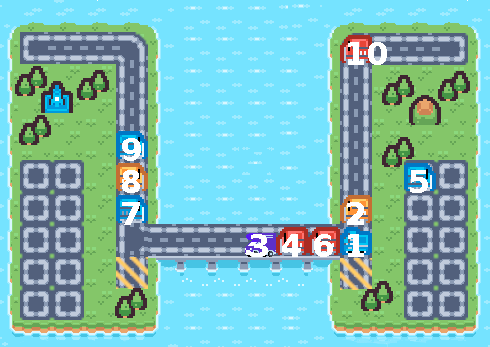

# Problema da Ponte Estreita
Uma aplicação do uso de threads em Java, usando Swing como interface gráfica.



### Situação Problema
Carros vindos do leste e carros vindos do oeste chegam a uma ponte com só uma pista. Os
que viajam no mesmo sentido podem atravessar a ponte ao mesmo tempo, mas os que viajam
em sentido oposto não podem. 

Portanto, um carro não pode atravessar a ponte quando houver
carros atravessando a ponte no sentido contrário. 

Modele os carros como threads e use
semáforos para sincronização entre threads. Os carros devem sair da ponte na mesma ordem
em que entraram (não é possível ultrapassagem, pois a ponte só tem uma pista).

### Restrições
Era necessário que toda a lógica de movimento de um carro estivesse dentro da sua thread, logo não foi usada animações do Swing para animar os carros, pois isso usaria outra thread.

### Solução
Tomamos como base um dos problemas clássicos, Escritores e Leitores, e o modificamos para permitir que vários carros de apenas um lado pudessem agir por vez.

### Uso
Executar o `car.jar` executavél já presente no repositório ou criar um novo usando o script `build.sh`.
```bash
$ java -jar car.jar
```